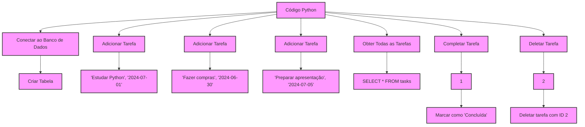

# Criar-banco-de-dados
Banco de dados

```mermaid
graph TD;
    style A fill:#f9f,stroke:#333,stroke-width:2px;
    style B fill:#f9f,stroke:#333,stroke-width:2px;
    style C fill:#f9f,stroke:#333,stroke-width:2px;
    style D fill:#f9f,stroke:#333,stroke-width:2px;
    style E fill:#f9f,stroke:#333,stroke-width:2px;
    style F fill:#f9f,stroke:#333,stroke-width:2px;
    style G fill:#f9f,stroke:#333,stroke-width:2px;
    style H fill:#f9f,stroke:#333,stroke-width:2px;
    style I fill:#f9f,stroke:#333,stroke-width:2px;
    style J fill:#f9f,stroke:#333,stroke-width:2px;
    style K fill:#f9f,stroke:#333,stroke-width:2px;
    style L fill:#f9f,stroke:#333,stroke-width:2px;
    style M fill:#f9f,stroke:#333,stroke-width:2px;
    style N fill:#f9f,stroke:#333,stroke-width:2px;
    style O fill:#f9f,stroke:#333,stroke-width:2px;
    style P fill:#f9f,stroke:#333,stroke-width:2px;
    style Q fill:#f9f,stroke:#333,stroke-width:2px;

    A[Código Python] --> B[Conectar ao Banco de Dados]
    B --> C[Criar Tabela]
    A --> D[Adicionar Tarefa]
    D --> E['Estudar Python', '2024-07-01']
    A --> F[Adicionar Tarefa]
    F --> G['Fazer compras', '2024-06-30']
    A --> H[Adicionar Tarefa]
    H --> I['Preparar apresentação', '2024-07-05']
    A --> J[Obter Todas as Tarefas]
    J --> K[SELECT * FROM tasks]
    A --> L[Completar Tarefa]
    L --> M[1]
    M --> N[Marcar como 'Concluída']
    A --> O[Deletar Tarefa]
    O --> P[2]
    P --> Q[Deletar tarefa com ID 2]


```
